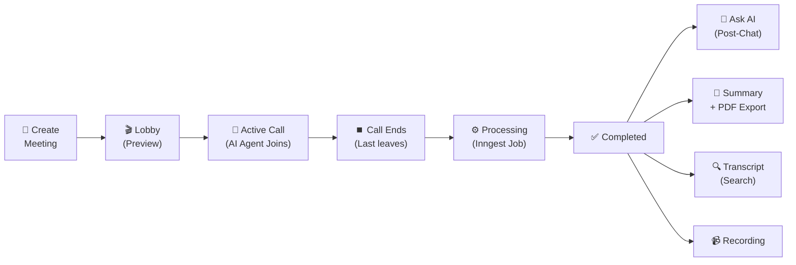

<h1 align="center">Meet.AI</h1>

<p align="center">
  
</p>

<p align="center">
  <b>AI-powered meeting assistant — intelligent agents that join your calls, transcribe conversations, generate summaries, and answer questions about what was discussed.</b>
</p>

<p align="center">
  <a href="#-key-features">Features</a> •
  <a href="#-architecture">Architecture</a> •
  <a href="#-tech-stack">Tech Stack</a> •
  <a href="#-getting-started">Getting Started</a>
</p>

<br>

<p align="center">
  
  
  
  
  
  
</p>

<br>

## ✨ Key Features

<table>
  <tr>
    <td width="33%" align="center">
      <h3>🤖 AI Agents</h3>
      <p>Create customizable agents with custom instructions and voice. Agents join calls as real participants, listen, and interact naturally.</p>
    </td>
    <td width="33%" align="center">
      <h3>📹 Smart Video Calls</h3>
      <p>WebRTC video with lobby controls, speaker layout, auto-transcription, and 1080p recording. Built on Stream Video SDK.</p>
    </td>
    <td width="33%" align="center">
      <h3>📝 AI Summaries</h3>
      <p>After each meeting, Groq (llama-3.3-70b) generates a structured markdown summary with overview and timestamped notes.</p>
    </td>
  </tr>
  <tr>
    <td width="33%" align="center">
      <h3>💬 Post-Meeting Chat</h3>
      <p>Chat with the AI agent about the meeting. The agent is scoped to answer only meeting-related questions.</p>
    </td>
    <td width="33%" align="center">
      <h3>🔍 Searchable Transcripts</h3>
      <p>Full-text transcript search with speaker identification and highlighted results.</p>
    </td>
    <td width="33%" align="center">
      <h3>📊 Dashboard</h3>
      <p>Central overview with stats cards (meetings, active now, completed, hours logged, agents), recent activity, and free trial progress.</p>
    </td>
  </tr>
  <tr>
    <td width="33%" align="center">
      <h3>📄 PDF Export</h3>
      <p>Download meeting summaries as clean PDF documents. Also supports TXT export for transcripts and summaries.</p>
    </td>
    <td width="33%" align="center">
      <h3>🎤 Real-time Voice</h3>
      <p>Google Gemini powers a real-time voice agent via the Vision Agents SDK, running on a dedicated Python FastAPI service.</p>
    </td>
    <td width="33%" align="center">
      <h3>🔐 Free Tier + Payments</h3>
      <p>Free tier with usage limits (3 meetings, 1 agent). Upgrade to paid plans via Polar.sh subscription management.</p>
    </td>
  </tr>
</table>

<br>

## 🏗️ Architecture

<p align="center">
  
</p>

### Flow

| Layer | Description |
|-------|-------------|
| **Next.js 15** | Full-stack React framework with App Router, server components, and API routes |
| **tRPC v11** | End-to-end type-safe API layer connecting frontend to database and services |
| **Stream** | WebRTC video calls with auto-transcription and recording + Chat SDK for post-meeting Q&A |
| **Inngest** | Serverless background jobs — processes transcripts, calls Groq for summarization |
| **Python FastAPI** | Standalone microservice hosting the Gemini-powered real-time voice agent |
| **Neon PostgreSQL** | Serverless Postgres database accessed via Drizzle ORM |

<br>

## ⚙️ Tech Stack

| Category | Technologies |
|----------|-------------|
| **Framework** | Next.js 15, React 19, TypeScript |
| **Styling** | Tailwind CSS v4, shadcn/ui, Radix UI, Framer Motion |
| **API Layer** | tRPC v11 + TanStack Query v5 (end-to-end type safety) |
| **Database** | PostgreSQL (Neon Serverless) + Drizzle ORM |
| **Auth** | Better-Auth (email/password, Google OAuth, GitHub OAuth) |
| **Video** | Stream Video SDK (WebRTC, transcription, recording) |
| **Chat** | Stream Chat SDK (post-meeting Q&A with AI) |
| **LLM** | Groq (llama-3.3-70b) — summarization, chat responses |
| **AI Voice** | Google Gemini — real-time voice agent via Vision Agents SDK |
| **Background Jobs** | Inngest (event-driven, serverless-agnostic) |
| **Payments** | Polar.sh (subscription management, free tier enforcement) |
| **Agent Service** | Python FastAPI + Vision Agents SDK (edge-deployed AI) |

<br>

## 🔄 Meeting Lifecycle



### Step-by-step

1. **📅 Create** — User creates a meeting with a name and assigned agent. Stream Video call is created with transcription and recording auto-enabled.

2. **🎬 Lobby** — User enters the call lobby with video/audio preview and toggle controls before joining.

3. **🎥 Active** — User joins the call. Webhook triggers status `active` and starts the Vision Agents Python service, deploying a Gemini-powered voice agent into the call. The AI agent listens and can speak based on its instructions while Stream handles transcription and recording.

4. **⏹️ End** — Last participant leaves. Webhook detects `call.session_ended` and sets status to `processing`.

5. **⚙️ Processing** — Inngest job fetches the transcript from Stream, parses JSONL, looks up speaker names, and sends to Groq (llama-3.3-70b) for summarization. Result saved to DB as markdown.

6. **✅ Complete** — Status set to `completed`. User can view the auto-refreshed summary, search the transcript, watch the recording, download a PDF summary, or chat with the agent about the meeting.

<br>

## 📂 Project Structure

```
src/
├── app/                              # Next.js App Router
│   ├── (auth)/                       # Sign-in, sign-up pages
│   ├── (dashboard)/                  # Dashboard, meetings, agents, upgrade
│   ├── call/                         # Video call pages (full-screen)
│   └── api/                          # API routes (tRPC, auth, webhooks, Inngest)
│
├── modules/                          # Feature-Sliced Design modules
│   ├── agents/                       # AI agent CRUD + UI
│   │   ├── server/procedures.ts      #   tRPC router (getMany, getOne, create, update, remove)
│   │   ├── schemas.ts                #   Zod validation schemas
│   │   └── ui/                       #   Components + views
│   │
│   ├── meetings/                     # Meeting management + lifecycle
│   │   ├── server/procedures.ts      #   tRPC router (CRUD, tokens, transcript, dashboard stats)
│   │   ├── schemas.ts                #   Zod validation schemas
│   │   └── ui/                       #   Components (states, chat, transcript) + views
│   │
│   ├── call/                         # Video call flow
│   │   └── ui/                       #   Lobby, active call, ended state
│   │
│   ├── auth/                         # Authentication views
│   ├── dashboard/                    # Layout, sidebar, navbar, dashboard view
│   ├── premium/                      # Subscription management + free tier
│   └── home/                         # Home page (redirects to dashboard)
│
├── trpc/                             # tRPC infrastructure
│   ├── init.ts                       #   Router init, procedures (protected, premium)
│   ├── client.tsx                    #   Client-side provider
│   ├── server.tsx                    #   Server-side helpers
│   └── routers/_app.ts               #   Combined app router
│
├── db/                               # Database
│   ├── schema.ts                     #   Drizzle schema (users, agents, meetings)
│   └── index.ts                      #   DB client
│
├── inngest/                          # Background jobs
│   ├── client.ts                     #   Inngest client
│   └── functions.ts                  #   Meeting processing (transcript → summary)
│
├── components/                       # Shared UI (shadcn/ui primitives)
├── hooks/                            # Shared hooks (useConfirm, useMobile)
└── lib/                              # Service configs (auth, polar, stream, utils)

vision-agent-service/                 # Python FastAPI microservice
└── main.py                           # Gemini real-time voice agent
```

<br>

## 🚀 Getting Started

### Prerequisites

- Node.js 18+
- Python 3.10+ (for vision agent service)
- A Neon PostgreSQL database
- API keys: Stream, Groq, Google Gemini, Polar.sh, GitHub/Google OAuth

### Setup

```bash
# 1. Install dependencies
npm install

# 2. Copy and fill environment variables
cp .env.example .env

# 3. Push database schema
npm run db:push

# 4. Start the Next.js dev server
npm run dev

# 5. (Optional) Start the vision agent service for AI voice
cd vision-agent-service
pip install -r requirements.txt
python main.py
```

<br>

## 🔐 Environment Variables

| Variable | Required | Description |
|----------|----------|-------------|
| `DATABASE_URL` | ✅ Yes | Neon PostgreSQL connection string |
| `BETTER_AUTH_SECRET` | ✅ Yes | Better-Auth encryption secret |
| `BETTER_AUTH_URL` | ✅ Yes | Auth callback URL (e.g. `http://localhost:3000`) |
| `GROQ_API_KEY` | ✅ Yes | Groq API key (LLM for summaries + chat) |
| `GEMINI_API_KEY` | ✅ Yes | Google Gemini API key (real-time AI voice) |
| `NEXT_PUBLIC_STREAM_VIDEO_API_KEY` | ✅ Yes | Stream Video public key (client-side) |
| `STREAM_VIDEO_SECRET_KEY` | ✅ Yes | Stream Video server secret |
| `NEXT_PUBLIC_STREAM_CHAT_API_KEY` | ✅ Yes | Stream Chat public key |
| `STREAM_CHAT_SECRET_KEY` | ✅ Yes | Stream Chat server secret |
| `GITHUB_CLIENT_ID` | 🔶 For OAuth | GitHub OAuth app ID |
| `GITHUB_CLIENT_SECRET` | 🔶 For OAuth | GitHub OAuth app secret |
| `GOOGLE_CLIENT_ID` | 🔶 For OAuth | Google OAuth client ID |
| `GOOGLE_CLIENT_SECRET` | 🔶 For OAuth | Google OAuth client secret |
| `POLAR_ACCESS_TOKEN` | 🔶 For payments | Polar.sh access token |
| `INNGEST_APP_URL` | 🔶 For jobs | Inngest app webhook URL |
| `VISION_AGENTS_URL` | 🔶 For voice | Python service URL (default: `http://localhost:8000`) |
| `VISION_AGENT_SECRET` | 🔶 For voice | Shared secret between Next.js and Python service |

<br>

## 💡 Design Decisions

<details>
<summary><b>Why tRPC over REST?</b></summary>
<br>
End-to-end type safety from DB schema to React components. No manual API client generation, no duplicated types. Changes to the backend schema automatically propagate to the frontend.
</details>

<details>
<summary><b>Why Feature-Sliced Modules?</b></summary>
<br>
Each feature (agents, meetings, call) is self-contained with its own schemas, types, procedures, and UI. Easy to add or modify features without touching unrelated code. Follows the Feature-Sliced Design methodology.
</details>

<details>
<summary><b>Why server-side prefetching?</b></summary>
<br>
Key pages (dashboard, meeting detail) prefetch data during SSR using <code>getQueryClient</code> + <code>HydrationBoundary</code>, avoiding client-side loading spinners and delivering a near-instant first paint.
</details>

<details>
<summary><b>Why polling over WebSockets for processing status?</b></summary>
<br>
During meeting processing, the detail page polls every 5 seconds. Simpler than maintaining a WebSocket connection, and the latency is acceptable (processing takes 10–60 seconds).
</details>

<details>
<summary><b>Why webhook-driven AI pipeline?</b></summary>
<br>
Stream webhooks trigger the entire post-meeting pipeline (transcript delivery, summarization, status transitions). This decouples processing from the user's request lifecycle and allows the UI to remain responsive.
</details>

<details>
<summary><b>Why a separate Python microservice for voice AI?</b></summary>
<br>
The Gemini real-time agent runs in a dedicated Python FastAPI service, isolated from the Next.js rendering path. This keeps the main app responsive and allows the voice agent to maintain persistent WebRTC connections without affecting the web server.
</details>

<details>
<summary><b>Prompt injection boundaries</b></summary>
<br>
User-provided agent instructions are delimited with clear start/end markers, followed by hard boundary rules that the model cannot override. This prevents prompt injection attacks through the agent configuration.
</details>

<br>

---

<p align="center">
  Built with Next.js, React, TypeScript, and ❤️
</p>
